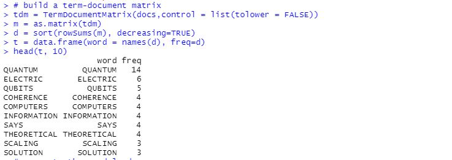
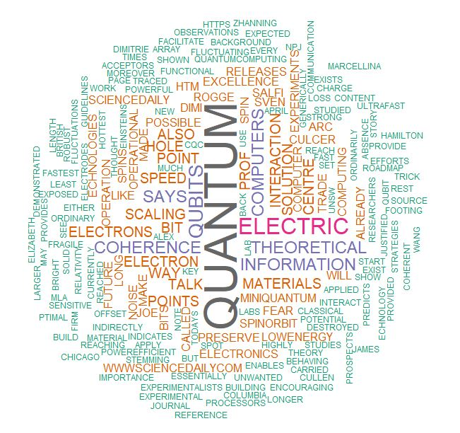

<h1><b>Wordcloud</b></h1>
<h2><b>Joel Yohannan
April 18th, 2021</b></h2>

<h2><b>Introduction</b></h2>

A word cloud (also called tag cloud or weighted list) is a visual representation of textual information. Words/tags are usually single words, and the importance of each is shown with varying font size or color. In this project I represent the data provided in “hidden wc data” text file as a wordcloud and represent the most frequently used words.

<h2><b>Report Background</b></h2>

Wordcloud is useful for quickly recognizing the most important terms and for finding a term alphabetically to determine its relative importance. Few reasons why we should use word-clouds to present your text data are: 1. They add simplicity and clarity, the most used keywords stand out better in a word-cloud, 2. They are a useful communication tool, easy to understand, to be shared and are impactful and 3. They are visually engaging than a table data. In R, two packages allow us to create wordcloud: Wordcloud and Wordcloud2. Many variations exist for wordcloud, shapes can be changed, even use the shape of an object related to the topic. It is also possible to play with text orientation, font, size, colors etc.

<b><h2>Analysis Tools</b></h2>
<b><h3>Libraries used:</b></h3>

1. wordcloud and wordcloud2: Help plot a cloud of words shared across documents and visualize differences and similarity between documents. 

2. tm: It is a text mining package. The text is loaded using Corpus() function from text mining (tm) package. Corpus is a list of a document (in our case, we only have one document). tm provides a set of predefined sources like VectorSource which handle a directory, a vector interpreting each component as document. To modify the document e.g., stemming, stopword removal, character removal, punctuation removal etc., in tm, all this functionality is contained into the concept of a transformation. Transformations are done via the tm_map() function which applies a function to all elements of the corpus. Basically, all transformations work on single text documents and tm_map() just applies them to all documents in a corpus.

3. SnowballC: Used for text stemming i.e., for reducing words to a common root to aid comparison of vocabulary.

4. RColorBrewer: This package contains ready-to-use color palettes for creating beautiful graphics.

<b><h2>Simulation</b></h2>
  
  

<b><h2>Concluding Remarks</b></h2> 
With my work I was able to find that when building a term document matrix, the words by default get converted to lower-case behind the scenes, so I had to manually disable this feature by setting tolower = FALSE, as follows: -  
tdm = TermDocumentMatrix(docs,control = list(tolower = FALSE)). 
I was able to list out the top 10 most frequently used words after removing certain stopwords and further was able to plot a wordcloud with most frequently used words being displayed the biggest and the least frequently used the smallest respectively. The above word cloud clearly shows that “QUANTUM”, “ELECTRIC”, “QUBITS”, “COHERENCE” and “COMPUTERS” are the five most important words in the “hidden wc data” text file. 

<h1>CODE CAN BE REVIEWED IN THE Project2-wordcloud.R FILE<h1>
  
